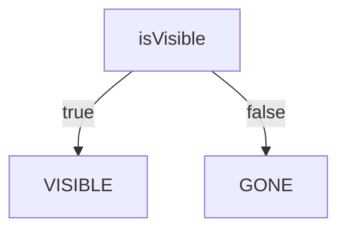
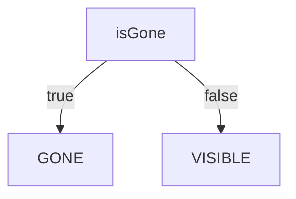
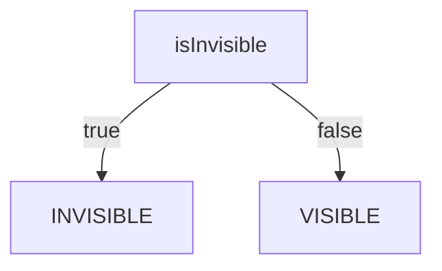

Android Viewでアプリを作っている場合、よくViewのVisibilityをプログラム的に変更したくなる。
その際によく用いられる手法はVisibilityを変更する拡張関数を作ること。

```kotlin
fun View.show() {
    visibility = View.VISIBLE
}

fun View.hide() {
    visibility = View.INVISIBLE
}

fun View.gone() {
    visibility = View.GONE
}
```

もっといい方法がないか調べているときにcore-ktxにProperty-based Approachというものを見つけて、こちらのほうが活用の幅が広そうだった。

```kotlin
view.isVisible // VISIBLEならtrue
view.isInvisible // INVISIBLEならtrue
view.isGone // GONEならtrue

// visibilityを変更する
view.isVisible = true // VISIBLEにする
view.isVisible = false // GONEにする
```

プロパティとして定義されていることの利点はvisibilityの取得と変更をゲッターとセッターによって実行できる点である
そのためviewのvisibilityを見て処理を実行する際に有効である

```kotlin
if(view.isGone) {
    // GONEだったときの振舞い
}
```

注意点があるとするとisVisibleがfalseだった場合はINVISIBLEではなくGONEの状態になっているので対応関係をきちんと把握しておく必要がある







## 参考文献

最初にプロパティベースのアプローチについて見つけたリンク
https://github.com/android/android-ktx/issues/135#issuecomment-363652935

ソースコード
https://android.googlesource.com/platform/frameworks/support/+/a9ac247af2afd4115c3eb6d16c05bc92737d6305/core/ktx/src/main/java/androidx/core/view/View.kt#216

ドキュメント
https://developer.android.com/reference/kotlin/androidx/core/view/package-summary#(android.view.View).isGone()

core-ktxについて言及している他の記事
https://www.kodeco.com/5576-android-ktx-tutorial-getting-started#toc-anchor-015
https://star-zero.medium.com/%E4%BE%BF%E5%88%A9%E3%81%AAktx-cc61b6d3ba00
