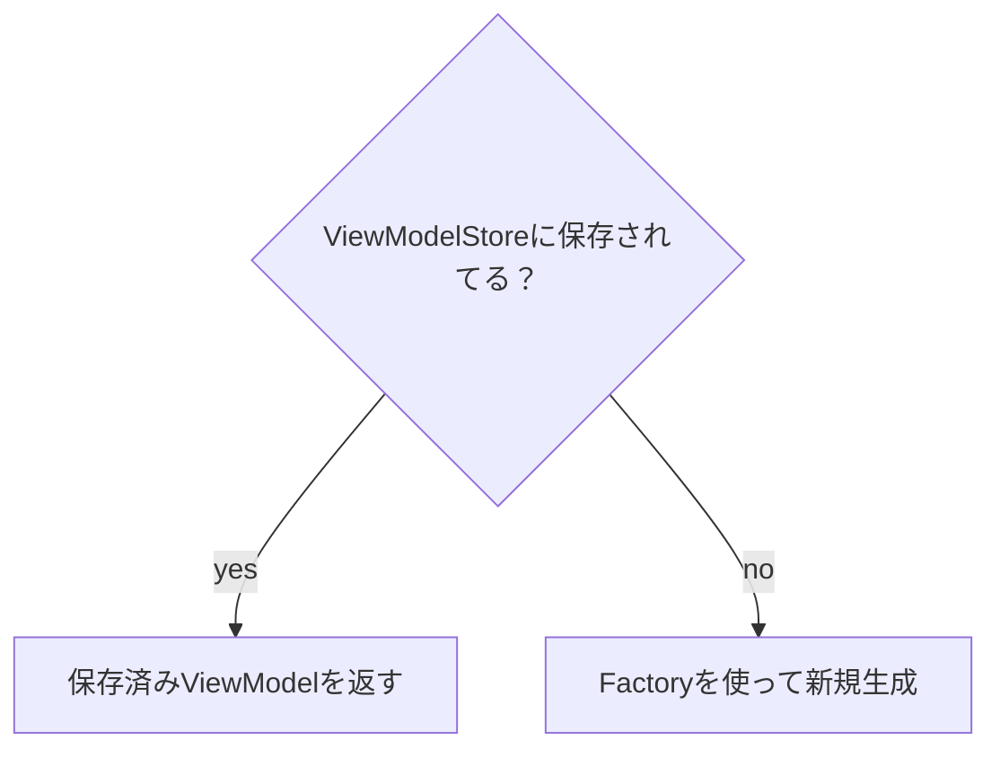

ViewModelインスタンスを作成する際には以下のAPIを利用したことがあると思います

```kotlin
// Activity/Fragment
val viewModel: FooViewModel by viewModels()

// Compose (+ Hilt)
val viewModel: FooViewModel = viewModel()

// Compose + Hilt + navigation-compose
val viewModel: FooViewModel = hiltViewModel()

// Compose + Hilt + nav3 with arguments
val viewModel = hiltViewModel<FooViewModel, FooViewModel.Factory>(
    creationCallback = { factory ->
        factory.create(key)
    }
)
```

普段から当たり前のように見るコードですが、次のような質問に回答できるでしょうか？

- コンストラクタはどうやって呼んでいるの？
- CreationExtrasっていうクラス名をたまに見かけるけどあれって何？
- SavedStateHandleのDI設定をした覚えはないけどなんでコンストラクタインジェクションができるの？

私がこれを追い始めたのは、Navigation 3 + ViewModel + Hilt の構成で開発していたとき、`SavedStateHandle` に `NavKey` の値が入っていないことに気づいたのがきっかけです。「そもそも `SavedStateHandle` はどこで生成され、どうやって ViewModel に注入されているのか？」という疑問から `viewModel()` の内部実装をたどることになり、その過程で ViewModelProvider・ViewModelProvider.Factory・CreationExtras という登場人物に行き着きました。本記事はその調査の記録です。

## ViewModelProvider: ViewModelインスタンスの返し方を知る者

例えば `androidx.lifecycle.viewmodel.compose.viewModel` の実装を見てみると内部ではViewModelProviderとやらを使ってインスタンスを取得しているのがわかります（`extras` のデフォルト値は説明のため簡略化しています。実際の分岐は後述します）

```kotlin
public fun <VM : ViewModel> viewModel(
    modelClass: KClass<VM>,
    viewModelStoreOwner: ViewModelStoreOwner =
        checkNotNull(LocalViewModelStoreOwner.current) {
            "No ViewModelStoreOwner was provided via LocalViewModelStoreOwner"
        },
    key: String? = null,
    factory: ViewModelProvider.Factory? = null,
    extras: CreationExtras = viewModelStoreOwner.defaultViewModelCreationExtras,
): VM {
    val resolvedFactory = factory ?: viewModelStoreOwner.defaultViewModelProviderFactory
    val provider = ViewModelProvider.create(viewModelStoreOwner, resolvedFactory, extras)
    // ViewModelProviderのgetメソッドを使ってインスタンスを取得している
    return if (key != null) {
        provider[key, modelClass]
    } else {
        provider[modelClass]
    }
}
```

[前回の記事](https://zenn.dev/solenoid/b09f3f36f24ba8)で解説した ViewModelStoreOwner（ViewModelStore を保持し、生成済みインスタンスを管理する）に加えて、 ViewModelProvider.Factory と CreationExtras というオブジェクトを受け取って ViewModelProvider インスタンスが作られています。
ViewModelProviderとは実行コンテキストにおいて適切なインスタンスを提供するオブジェクトであり、ViewModelインスタンスを新規生成するのか、すでに作られたインスタンスを返すのかという判断をカプセル化しています。

```kotlin
internal class ViewModelProviderImpl(
    private val store: ViewModelStore,
    private val factory: ViewModelProvider.Factory,
    private val defaultExtras: CreationExtras,
) {
    private val lock = SynchronizedObject()

    internal fun <T : ViewModel> getViewModel(
        modelClass: KClass<T>,
        key: String = ViewModelProviders.getDefaultKey(modelClass),
    ): T {
        return synchronized(lock) {
            // まずはViewModelStoreから取得できるか試みる
            val viewModel = store[key]
            // key名が同じでも、型が違う場合があるのでチェック
            if (modelClass.isInstance(viewModel)) {
                return@synchronized viewModel as T
            }

            val modelExtras = MutableCreationExtras(defaultExtras)
            modelExtras[ViewModelProvider.VIEW_MODEL_KEY] = key

            // ViewModelProvider.Factory + CreationExtrasを使って新規生成
            return@synchronized createViewModel(factory, modelClass, modelExtras).also { vm ->
                // 生成後はViewModelStoreに記録
                store.put(key, vm)
            }
        }
    }
}

internal actual fun <VM : ViewModel> createViewModel(
    factory: ViewModelProvider.Factory,
    modelClass: KClass<VM>,
    extras: CreationExtras,
): VM {
    // ViewModelProvider.Factory#createを呼ぶだけだが、バイナリ互換性のために3段階のフォールバックがある
    return try {
        factory.create(modelClass, extras)
    } catch (e: AbstractMethodError) {
        try {
            factory.create(modelClass.java, extras)
        } catch (e: AbstractMethodError) {
            factory.create(modelClass.java)
        }
    }
}
```



## ViewModelProvider.Factory: インスタンス生成方法を知る者
次にインスタンス生成方法の具体を知っているViewModelProvider.Factoryについて解説していきます。
ViewModelProvider.Factoryとはcreateというメソッドを持つインターフェースです。

```kotlin
public interface Factory {
    public open fun <T : ViewModel> create(modelClass: KClass<T>, extras: CreationExtras): T
}
```

自前のFactoryを作ることもできますが、フレームワークはデフォルト実装を提供しています
具体的な処理はAndroidの場合、JvmViewModelProviders#createViewModelに委譲され、引数なしコンストラクタが実行されます

```kotlin
internal actual object DefaultViewModelProviderFactory : ViewModelProvider.Factory {
    override fun <T : ViewModel> create(modelClass: Class<T>): T =
        JvmViewModelProviders.createViewModel(modelClass)
}

// リフレクションベースのViewModel生成器
internal object JvmViewModelProviders {
    fun <T : ViewModel> createViewModel(modelClass: Class<T>): T {
        // リフレクションを使ってコンストラクタを取得
        val constructor =
            try {
                modelClass.getDeclaredConstructor()
            } catch (e: NoSuchMethodException) {
                throw RuntimeException("Cannot create an instance of $modelClass", e)
            }

        // コンストラクタがpublicでなければ例外を投げる
        if (!Modifier.isPublic(constructor.modifiers)) {
            throw RuntimeException("Cannot create an instance of $modelClass")
        }

        // コンストラクタ（引数なし）を実行
        return try {
            constructor.newInstance()
        } catch (e: InstantiationException) {
            throw RuntimeException("Cannot create an instance of $modelClass", e)
        } catch (e: IllegalAccessException) {
            throw RuntimeException("Cannot create an instance of $modelClass", e)
        }
    }
}
```

コンストラクタで外部依存の注入を必要としないViewModelについては特別Hiltなどの設定をしなくとも `by viewModels()` とするだけでインスタンスが取得できるということです
Hiltを使って外部依存を解決したり、Assisted Injectによってランタイム依存の注入もできますが、その裏では ViewModelProvider.Factory・CreationExtras・各種 Key が協調して動作しています

ViewModelProvider.Factoryを実装する必要がある場合は、簡単に実装するためのDSLが用意されています

```kotlin
val Factory = viewModelFactory {
    initializer<HogeViewModel> { // CreationExtrasがレシーバーなので必要な依存があれば取り出せる
        val userId = get("userId")
        HogeViewModel(userId)
    }
}
```

## CreationExtras: 追加情報を提供する者
ViewModelにSavedStateHandleやApplicationを渡すことができますが、これを実現しているのがCreationExtrasというオブジェクトです。
あまり聞き馴染みのないものかもしれませんが、普段から利用しているAPIのシグネチャを見てみると案外身近で見かけることができます。

```kotlin
@MainThread
public inline fun <reified VM : ViewModel> ComponentActivity.viewModels(
    noinline extrasProducer: (() -> CreationExtras)? = null,
    //                              ~~~~~~~~~~~~~~
    noinline factoryProducer: (() -> Factory)? = null,
)

@Composable
public inline fun <reified VM : ViewModel> viewModel(
    viewModelStoreOwner: ViewModelStoreOwner =
        checkNotNull(LocalViewModelStoreOwner.current) {
            "No ViewModelStoreOwner was provided via LocalViewModelStoreOwner"
        },
    key: String? = null,
    factory: ViewModelProvider.Factory? = null,
    // ↓↓↓
    extras: CreationExtras =
        if (viewModelStoreOwner is HasDefaultViewModelProviderFactory) {
            viewModelStoreOwner.defaultViewModelCreationExtras
        } else {
            CreationExtras.Empty
        },
)
```

CreationExtrasが何をしているかというとViewModelProvider.FactoryにSavedStateHandleやApplicationなど追加の依存を提供しています
（これによりViewModelProvider.Factoryをstatelessに保っているんですが、statelessだと何が嬉しいのかなどを解説すると本筋から逸れていくので本記事では割愛します）

例えばSavedStateHandleについてライブラリ内部では次のように取り扱われています

```kotlin
// 1 CreationExtrasへの格納
/// activity/activity/src/main/java/androidx/activity/ComponentActivity.kt
override val defaultViewModelCreationExtras: CreationExtras
    get() {
        // Application, ViewModelStoreOwner, Bundleを詰め込んでいる
        val extras = MutableCreationExtras()
        if (application != null) {
            extras[APPLICATION_KEY] = application
        }
        extras[SAVED_STATE_REGISTRY_OWNER_KEY] = this
        extras[VIEW_MODEL_STORE_OWNER_KEY] = this
        val intentExtras = intent?.extras
        if (intentExtras != null) {
            extras[DEFAULT_ARGS_KEY] = intentExtras
        }
        return extras
    }

// 2 ViewModelProvider.Factory#createに渡される
/// lifecycle/lifecycle-viewmodel/src/androidMain/kotlin/androidx/lifecycle/viewmodel/internal/ViewModelProviderImpl.android.kt
internal actual fun <VM : ViewModel> createViewModel(
    factory: ViewModelProvider.Factory,
    modelClass: KClass<VM>,
    extras: CreationExtras,
): VM {
    return try {
        factory.create(modelClass, extras) // <-
    } catch (e: AbstractMethodError) {
        try {
            factory.create(modelClass.java, extras)
        } catch (e: AbstractMethodError) {
            factory.create(modelClass.java)
        }
    }
}

// 3 取り出して、ViewModelのコンストラクタに渡される
/// lifecycle/lifecycle-viewmodel-savedstate/src/androidMain/kotlin/androidx/lifecycle/SavedStateViewModelFactory.android.kt
public actual class SavedStateViewModelFactory : ViewModelProvider.Factory {
    override fun <T : ViewModel> create(modelClass: Class<T>, extras: CreationExtras): T {
        // ...
        val handle = extras.createSavedStateHandle() // <-
        /// ...
    }
}

/// lifecycle/lifecycle-viewmodel-savedstate/src/commonMain/kotlin/androidx/lifecycle/SavedStateHandleSupport.kt
@MainThread
public fun CreationExtras.createSavedStateHandle(): SavedStateHandle {
    // savedStateRegistryOwner, ViewModelStoreOwner, ViewModelの存在をチェックした上でSavedStateHandleを作成
    val savedStateRegistryOwner =
        requireNotNull(this[SAVED_STATE_REGISTRY_OWNER_KEY]) {
            "CreationExtras must have a value by `SAVED_STATE_REGISTRY_OWNER_KEY`"
        }
    val viewModelStateRegistryOwner =
        requireNotNull(this[VIEW_MODEL_STORE_OWNER_KEY]) {
            "CreationExtras must have a value by `VIEW_MODEL_STORE_OWNER_KEY`"
        }
    val key =
        requireNotNull(this[VIEW_MODEL_KEY]) {
            "CreationExtras must have a value by `VIEW_MODEL_KEY`"
        }

    val defaultArgs = this[DEFAULT_ARGS_KEY]
    return createSavedStateHandle(
        savedStateRegistryOwner,
        viewModelStateRegistryOwner,
        key,
        defaultArgs,
    )
}
```

## まとめ

冒頭で挙げた4つの疑問を、ここまでの内容で振り返ります。

- **コンストラクタはどうやって呼んでいるの？**
  ViewModelProvider がまず ViewModelStore に同じ key のインスタンスがあるか確認し、無ければ ViewModelProvider.Factory に生成を委譲します。デフォルトの Factory は最終的にリフレクションで引数なしコンストラクタ（`JvmViewModelProviders#createViewModel`）を呼び出してインスタンスを生成します。
- **Factoryパターンが使われることがあるけどなんで？**
  「新規生成するか、キャッシュを返すか」という判断は ViewModelProvider が一手に引き受け、実際の生成手順だけを ViewModel.Factory に切り出しているからです。こうしておくと、依存の有無や生成方法が ViewModel ごとに違っても、Factory を差し替えるだけで対応できます。
- **CreationExtrasって何？**
  Factory に SavedStateHandle や Application などの追加の依存を渡すための入れ物です。依存を CreationExtras 経由で渡すことで、Factory 自身は状態を持たない（stateless）まま保たれます。
- **SavedStateHandleのDI設定をした覚えはないのにコンストラクタインジェクションができるのはなんで？**
  ViewModelStoreOwner の `defaultViewModelCreationExtras` が Application・SavedStateRegistryOwner・Bundle などを CreationExtras に詰め、それが `Factory#create` に渡されます。`SavedStateViewModelFactory` がその CreationExtras から `createSavedStateHandle()` で SavedStateHandle を組み立て、ViewModel のコンストラクタに渡しているためです。自分で DI 設定をしなくても、フレームワークがこの一連の流れを肩代わりしてくれているわけです。

「どこで生成され、どう注入されるのか」を押さえておくと、SavedStateHandle に「入っているはず／入っていない」の切り分けが自分でできるようになります。最初のきっかけだった「Navigation 3 の NavKey が SavedStateHandle に入っていない」という疑問については、別の記事でHiltとの統合に踏み込んで解説する中で解決予定です。
