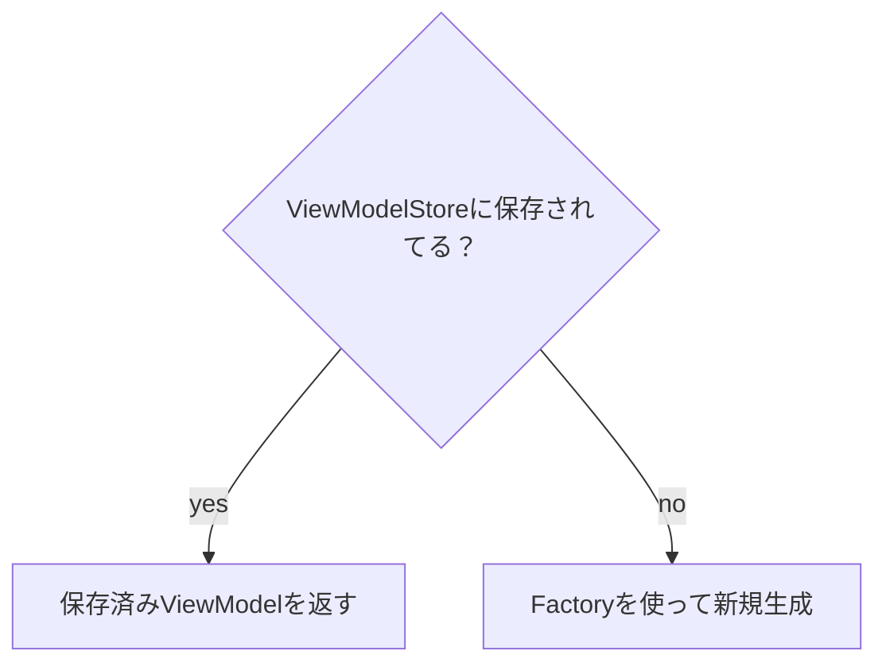

ViewModelインスタンスを作成する際には以下のAPIを利用したことがあるでしょう

```kotlin
// Activity/Fragment
val viewModel: FooViewModel by viewModels()

// Compose (+ Hilt)
val viewModel: FooViewModel = viewModel()

// Compose + Hilt + navigation-compose
val viewModel: FooViewModel = hiltViewModel()

// Compose + Hilt + nav3 with arguments
val viewModel = hiltViewModel<FooViewModel, FooViewModel.Factory>(
    creationCallback = { factory ->
        factory.create(key)
    }
)
```

普段から当たり前のように見るコードですが、次のような質問に回答できるでしょうか？

- コンストラクタはどうやって呼んでいるの？
- Factoryパターンが使われることがあるけどなんで？
- CreationExtrasっていうクラス名をたまに見かけるけどあれって何？
- SavedStateHandleのDI設定をした覚えはないけどなんでコンストラクタインジェクションができるの？

## ViewModelProvider: ViewModelインスタンスの返し方を知る者

例えば `androidx.lifecycle.viewmodel.compose.viewModel` の実装を見てみると内部ではViewModelProviderとやらを使ってインスタンスを取得しているのがわかります

```kotlin
public fun <VM : ViewModel> viewModel(
    modelClass: KClass<VM>,
    viewModelStoreOwner: ViewModelStoreOwner =
        checkNotNull(LocalViewModelStoreOwner.current) {
            "No ViewModelStoreOwner was provided via LocalViewModelStoreOwner"
        },
    key: String? = null,
    factory: ViewModelProvider.Factory? = null,
    extras: CreationExtras = viewModelStoreOwner.defaultViewModelCreationExtras,
): VM {
    val resolvedFactory = factory ?: viewModelStoreOwner.defaultViewModelProviderFactory
    val provider = ViewModelProvider.create(viewModelStoreOwner, resolvedFactory, extras)
    // ViewModelProviderのgetメソッドを使ってインスタンスを取得している
    return if (key != null) {
        provider[key, modelClass]
    } else {
        provider[modelClass]
    }
}
```

前回の記事で解説した、作成済みのViewModelインスタンスを管理しているViewModelStoreを管理しているViewModelStoreOwnerに加えて、インスタンスの生成方法を知っているViewModelProviderr.FactoryとCreationExtrasを受け取ってViewModelProviderインスタンスが作られています。
ViewModelProviderとは実行コンテキストにおいて適切なインスタンスを提供するオブジェクトであり、ViewModelインスタンスを新規生成するのか、すでに作られたインスタンスを返すのかという判断をカプセル化しています。

```kotlin
internal class ViewModelProviderImpl(
    private val store: ViewModelStore,
    private val factory: ViewModelProvider.Factory,
    private val defaultExtras: CreationExtras,
) {
    private val lock = SynchronizedObject()

    internal fun <T : ViewModel> getViewModel(
        modelClass: KClass<T>,
        key: String = ViewModelProviders.getDefaultKey(modelClass),
    ): T {
        return synchronized(lock) {
            // まずはViewModelStoreから取得できるか試みる
            val viewModel = store[key]
            // key名が同じでも、型が違う場合があるのでチェック
            if (modelClass.isInstance(viewModel)) {
                return@synchronized viewModel as T
            }

            val modelExtras = MutableCreationExtras(defaultExtras)
            modelExtras[ViewModelProvider.VIEW_MODEL_KEY] = key

            // ViewModelProvider.Factory + CreationExtrasを使って新規生成
            return@synchronized createViewModel(factory, modelClass, modelExtras).also { vm ->
                // 生成後はViewModelStoreに記録
                store.put(key, vm)
            }
        }
    }
}

internal actual fun <VM : ViewModel> createViewModel(
    factory: ViewModelProvider.Factory,
    modelClass: KClass<VM>,
    extras: CreationExtras,
): VM {
    // ViewModelProvider.Factory#createを呼ぶだけだが、後方互換性のために3段階のフォールバックがある
    return try {
        factory.create(modelClass, extras)
    } catch (e: AbstractMethodError) {
        try {
            factory.create(modelClass.java, extras)
        } catch (e: AbstractMethodError) {
            factory.create(modelClass.java)
        }
    }
}
```



## ViewModelProvider.Factory: インスタンス生成方法を知る者
次にインスタンス生成方法の具体を知っているViewModelProvider.Factoryについて解説していきます。
ViewModelProvider.Factoryとはcreateというメソッドを持つインターフェースです。

```kotlin
public interface Factory {
    public open fun <T : ViewModel> create(modelClass: KClass<T>, extras: CreationExtras): T
}
```

自前のFactoryを作ることもできますが、フレームワークはデフォルト実装を持っています
具体的な処理はAndroidの場合、JvmViewModelProviders#createViewModelに委譲され、引数なしコンストラクタが実行されます

```kotlin
internal actual object DefaultViewModelProviderFactory : ViewModelProvider.Factory {
    override fun <T : ViewModel> create(modelClass: Class<T>): T =
        JvmViewModelProviders.createViewModel(modelClass)
}

internal object JvmViewModelProviders {
    fun <T : ViewModel> createViewModel(modelClass: Class<T>): T {
        // リフレクションを使ってコンストラクタを取得
        val constructor =
            try {
                modelClass.getDeclaredConstructor()
            } catch (e: NoSuchMethodException) {
                throw RuntimeException("Cannot create an instance of $modelClass", e)
            }

        // コンストラクタがpublicでなければ例外を投げる
        if (!Modifier.isPublic(constructor.modifiers)) {
            throw RuntimeException("Cannot create an instance of $modelClass")
        }

        // コンストラクタ（引数なし）を実行
        return try {
            constructor.newInstance()
        } catch (e: InstantiationException) {
            throw RuntimeException("Cannot create an instance of $modelClass", e)
        } catch (e: IllegalAccessException) {
            throw RuntimeException("Cannot create an instance of $modelClass", e)
        }
    }
}
```

つまり、コンストラクタで外部依存の注入を必要としないViewModelについては

## CreationExtras: 追加情報を提供する者
## APPENDIX: ViewModelProvider.Factoryの歴史
### 初期: Statefull Factory
### 中期: Stateless Factory
### 後期: KMP compatibility

