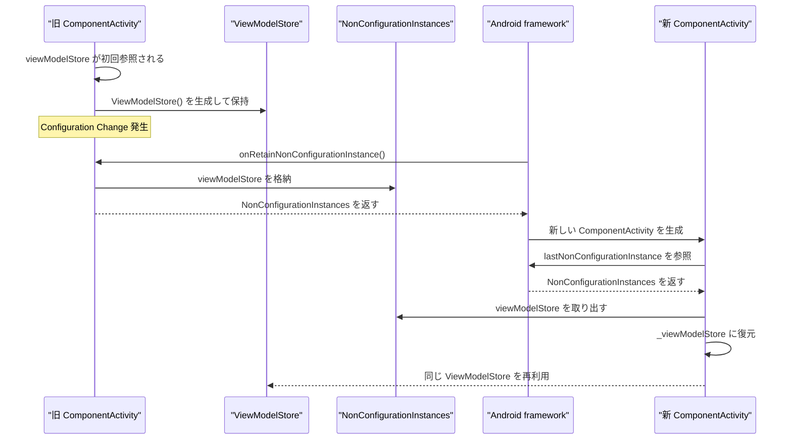
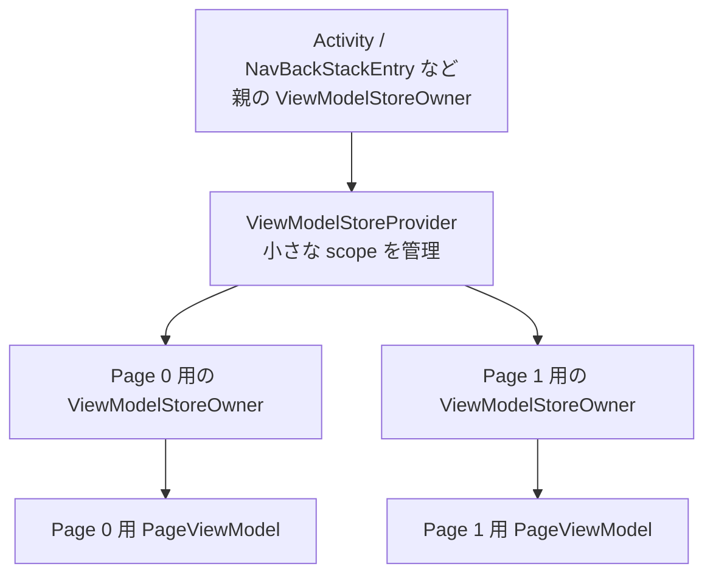
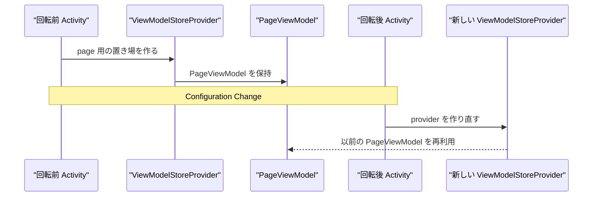

## 最近のJetpackのリリースで追加されたViewModel関連のAPI

直近2-3ヶ月の間に以下のAPIが追加されました
[lifecycle 2.11.0-alpha02](https://developer.android.com/jetpack/androidx/releases/lifecycle?hl=ja#2.11.0-alpha02)
- `rememberViewModelStoreProvider: ViewModelStoreProvider`
- `rememberViewModelStoreOwner: ViewModelStoreOwner`
[hilt 1.4.0-beta01](https://developer.android.com/jetpack/androidx/releases/hilt?hl=ja#1.4.0-beta01)
- `rememberHiltViewModelFactory: ViewModelProvider.Factory`

これらを使うことによってComposable関数スコープのViewModelを作成可能になります

```kotlin
// Page単位のViewModelを作成しているところ
val provider = rememberViewModelStoreProvider()
val pagerState = rememberPagerState(pageCount = { 5 })

HorizontalPager(state = pagerState) { page ->
    val storeOwner = rememberViewModelStoreOwner(provider, key = page)

    CompositionLocalProvider(LocalViewModelStoreOwner provides storeOwner) {
        val viewModel: PageViewModel = viewModel()
    }
}
```

ViewModelと付いているので、ViewModelに関連するものだということはわかりますが、これらのコンポーネントはどのような役目を持っているのでしょうか？
`ViewModelStoreProvider` は上記のリリースで新たに追加されたコンポーネントですが、それ以外(`ViewModelStoreOwner`, `ViewModelProvider.Factory`)はViewModelが作られた頃から存在します
`ViewModelStoreOwner` はViewModelが構成変更を越えて状態を保持する仕組みに関連しており、`ViewModelProvider`はViewModelインスタンスの取得、`ViewModelProvider.Factory`はViewModelインスタンスの生成についての責務を負っています。
本記事では `ViewModelStoreOwner` 及び `ViewModelStore` について解説します

## 対象読者

- Androidエンジニア中級者

## TL;DR

- ViewModelStore: ViewModelを構成変更を超えて保持する者。管理しているViewModelをまとめてclearする権限を持つ
- ViewModelStoreOwner: ViewModelStoreをclearするタイミングを管理する者。

## ViewModelStoreOwner: ViewModelStoreの持ち主

説明が簡単なものから先に行います。ViewModelStoreOwnerとはViewModelStoreをプロパティとして持つだけのシンプルなインターフェースである。

```kotlin
// lifecycle/lifecycle-viewmodel/src/commonMain/kotlin/androidx/lifecycle/ViewModelStoreOwner.kt
public interface ViewModelStoreOwner {
    public val viewModelStore: ViewModelStore
}
```

ViewModelStoreOwnerはActivity/Fragment/NavBackStackEntryなどのライフサイクルを持つコンポーネントで実装されている

```kotlin
public open class ComponentActivity() :
    // ...
    ViewModelStoreOwner,
    // ...
```

そしてそれらが持つライフサイクルが寿命を迎えるタイミングで、リソース解放する[^1]
[^1]: Activityでの実装はごく単純だが、FragmentやNavBackStackEntryの場合はもっと複雑になる

```kotlin
init {
    @Suppress("LeakingThis")
    lifecycle.addObserver(
        LifecycleEventObserver { _, event ->
            if (event == Lifecycle.Event.ON_DESTROY) {
                // ライフサイクルがonDestroyかつ、isChangingConfigurationsがfalseである時(= Activityが構成変更以外の理由で破棄される時)
                // viewModelStoreをclearする
                if (!isChangingConfigurations) {
                    viewModelStore.clear()
                }
            }
        }
    )
}
```

## ViewModelStore: ViewModelをConfiguration Changeの向こう側に連れていく

ViewModelStoreはViewModelをMapで管理し、そのMapの操作とViewModelをclearするAPIを提供している

```kotlin
public open class ViewModelStore {
    private val map = mutableMapOf<Any?, ViewModel>()

    public fun put(key: Any?, viewModel: ViewModel) {
        val oldViewModel = map.put(key, viewModel)
        oldViewModel?.clear()
    }

    public operator fun get(key: Any?): ViewModel? = map[key]

    public fun <T : ViewModel> getOrPut(key: Any?, defaultValue: () -> T): T =
        map.getOrPut(key, defaultValue) as T

    public fun keys(): Set<Any?> = map.keys.toSet()

    public fun clear() {
        val snapshot = map.toMap()
        map.clear()
        for (viewModel in snapshot.values) {
            viewModel.clear()
        }
    }
}
```

ViewModelStoreの実装からは、これがただ単にViewModelを複数持てる箱くらいのことしかわかりませんが、ViewModelStoreが利用されている箇所を見ることで、ViewModelがいかにして構成変更を生き延びているのかがわかります
それを理解するためコンポーネントを追加します
`onRetainNonConfigurationInstance` `getLastNonConfigurationInstance`

### `onRetainNonConfigurationInstance`/`getLastNonConfigurationInstance`: 構成変更を生き延びる方法
ViewModel登場以前、構成変更を超えて状態を保持する手段は3つありました。

- Activity#onSaveInstanceStateで保存 / Activity#onCreateで復元
- Activity#onRetainNonConfigurationInstanceで保存 / Activity#getLastNonConfigurationInstanceで復元
- Fragment#setRetainInstance(true)で、 Fragment が破棄されないようにする

ViewModelでは2つ目の方法が利用されています。
`onRetainNonConfigurationInstance` (https://developer.android.com/reference/android/app/Activity#onRetainNonConfigurationInstance()) とは構成変更によってActivityが再生成される時に、システムによって呼び出され、任意のオブジェクトを再生成されるActivityに引き継ぐためのライフサイクルメソッドです。再生成されたActivityからは `getLastNonConfigurationInstance` を呼び出すことによって復元ができる。
この仕組みを使ってViewModelStoreは構成変更を生き延びます。



## ViewModelStoreProvider: Composeの世界でViewModelStoreのライフサイクルを管理する者

Composeでのコード例を理解するために `ViewModelStoreProvider` も解説しておきます。
ViewModelStoreProviderはViewModelStoreの作成、取得(実際は親ViewModelStoreから取得する)、破棄の責務を持ち、従来のActiivtyやFragmentよりも細かいライフサイクル制御を可能とし、Composable関数と統合しやすくしている

- ViewModelStoreProviderを含むスコープがCompositionから外れたらViewModelStoreをクリアする
- clearKey(key: Any?)を実行すれば明示的にクリアも可能
- Configuration Change対応は親ViewModelStoreOwner（典型的にはComponentActivity）に任せる

## Composable関数スコープのViewModelの理解

理解の準備が整ったので最初のコード例を細かく見ていく

```kotlin
val provider = rememberViewModelStoreProvider()
val pagerState = rememberPagerState(pageCount = { 5 })

HorizontalPager(state = pagerState) { page ->
    val storeOwner = rememberViewModelStoreOwner(provider, key = page)

    CompositionLocalProvider(LocalViewModelStoreOwner provides storeOwner) {
        val viewModel: PageViewModel = viewModel()
    }
}
```

```kotlin
val provider = rememberViewModelStoreProvider()
```

HorizontalPagerをラップしている親コンポーネントでViewModelStoreProviderを作成している
このProviderによって作成されるViewModelStoreが破棄されるタイミングは明示的にclearKeyを実行しない限りは親コンポーネントがCompositionを離れるタイミングとなる
`rememberViewModelStoreProvider()` を引数なしで呼び出した場合は、親ViewModelStoreOwnerは `LocalViewModelStoreOwner.current` でセットされる(Single Activity構成であればComponentActivityだと思われる)

```kotlin
HorizontalPager(state = pagerState) { page ->
    val storeOwner = rememberViewModelStoreOwner(provider, key = page)
```

ページ毎のViewModelStoreOwnerを作成している
ページ**毎**になるようにkeyを渡している
providerを受け取っているので、このViewModelStoreのライフサイクルはproviderに従う

```kotlin
    CompositionLocalProvider(LocalViewModelStoreOwner provides storeOwner) {
        val viewModel: PageViewModel = viewModel()
    }
```

LocalViewModelStoreOwnerとして先ほど作成したものを注入している
このスコープで `viewModel()` を実行すると、そのページのViewModelStoreで管理されたPageViewModelインスタンスが作成される
viewModelはページを切り替えるだけでは破棄されず、HorizontalPagerをラップしている親コンポーネントがCompositionから離れる時にようやく破棄される



構成変更が発生した時、ページ毎に作成されたViewModelStoreOwnerは更に上位のViewModelStoreOwner(= CommponentActivity)によって管理されているので、構成変更を生き延び、Composition再作成後に復元される



## 次回予告
次回はViewModelイスタンスの取得・作成に関わるViewModelProvider, ViewModelProvider.Factory, CreaationExtrasについて解説しようと思ってます。これらを理解することでViewModelへのDIがどのように解決されているのかやSavedState APIとの統合がどのように実現しているのかが理解できるようになります。

## References
Activity再生成時にWebViewのHTMLを維持する方法: https://qiita.com/granoeste/items/ccad91feb45d386872ac
androidx/androidx: https://github.com/androidx/androidx

