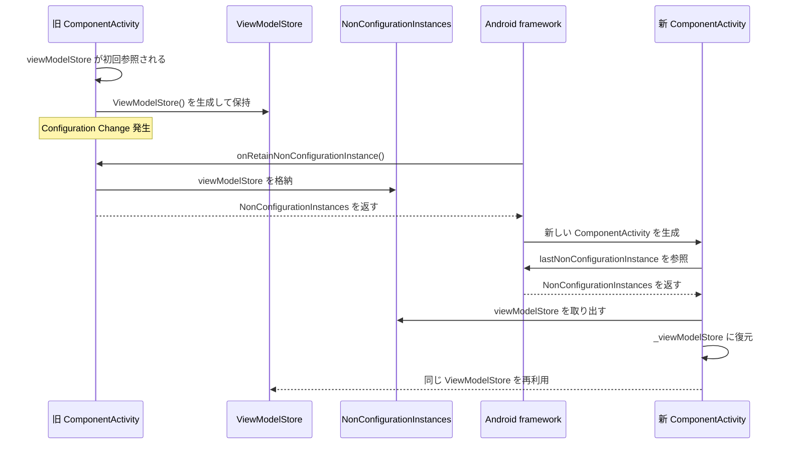
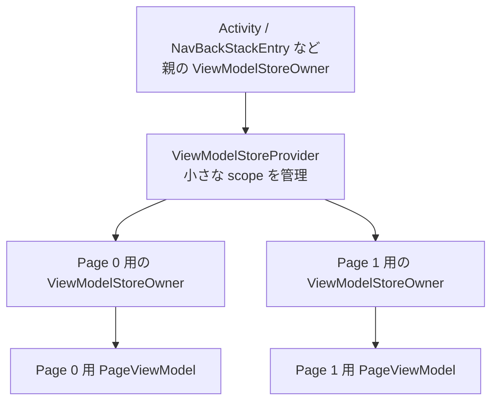
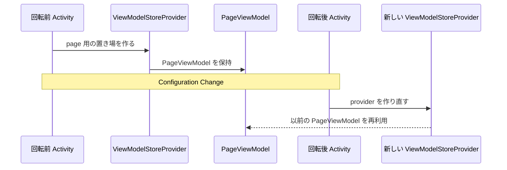

## はじめに

最近、`HorizontalPager` でページごとに独立した ViewModel を持たせたくなり、方法を調べていました。たどり着いたのが、直近のリリースで追加された次の API です。

- [lifecycle 2.11.0-alpha02](https://developer.android.com/jetpack/androidx/releases/lifecycle?hl=ja#2.11.0-alpha02): `rememberViewModelStoreProvider`, `rememberViewModelStoreOwner`
- [hilt 1.4.0-beta01](https://developer.android.com/jetpack/androidx/releases/hilt?hl=ja#1.4.0-beta01): `rememberHiltViewModelFactory`

これらを組み合わせると、Composable 関数のスコープに紐づいた ViewModel を作れます。実際に書いてみたのが次のコードです。

```kotlin
// ページごとに独立した ViewModel を作る
val provider = rememberViewModelStoreProvider()
val pagerState = rememberPagerState(pageCount = { 5 })

HorizontalPager(state = pagerState) { page ->
    val storeOwner = rememberViewModelStoreOwner(provider, key = page)

    CompositionLocalProvider(LocalViewModelStoreOwner provides storeOwner) {
        val viewModel: PageViewModel = viewModel()
    }
}
```

動かすこと自体はできました。でも、書きながらずっと引っかかっていました。`ViewModelStoreOwner` とは何者なのでしょうか。`viewModel()` を呼ぶだけで済ませてきた私にとって、`ViewModelStoreProvider` も `ViewModelStoreOwner` も、急に現れた馴染みのない型でした。

調べてみると、`ViewModelStoreProvider` はこのリリースで新しく追加されたものですが、それ以外（`ViewModelStoreOwner`, `ViewModelProvider`, `ViewModelProvider.Factory`）は ViewModel が生まれた頃から存在していました。つまり、私が今まで見てこなかっただけで、`viewModel()` の裏側ではずっとこれらが働いていたわけです。それぞれの責務は、おおまかに次の通りです。

- `ViewModelStoreOwner`: ViewModel が構成変更を越えて状態を保持する仕組みに関わる
- `ViewModelProvider`: ViewModel インスタンスの取得
- `ViewModelProvider.Factory`: ViewModel インスタンスの生成

一度に全部を説明すると巨大になるので、本記事ではまず `ViewModelStoreOwner` と `ViewModelStore` に絞り、「`viewModel()` の裏で誰が ViewModel を持っているのか」を解き明かします。

## 対象読者

- `viewModel()` や `hiltViewModel()` で ViewModel を取得するのは日常的にやっているが、その裏で誰が ViewModel を保持し、いつ破棄しているのかは意識したことがない人

## TL;DR

- **ViewModelStore**: ViewModel をまとめて保持する箱。`clear()` で抱えている ViewModel をまとめて破棄します
- **ViewModelStoreOwner**: その箱（ViewModelStore）を公開するだけのインターフェース。箱を「いつ clear するか」「どうやって構成変更を生き延びさせるか」は、これを実装するクラス（Activity など）が決めます
- **ViewModelStoreProvider**: Compose で、親 Owner の配下に key ごとの子 ViewModelStore を作るクラス。Pager の 1 ページなど、Activity より細かい単位でスコープを区切れる。コンポーネントが Composition から外れると自動で clear される

## ViewModelStoreOwner: ViewModelStoreの持ち主

説明が簡単なものから先に行います。ViewModelStoreOwner とは、ViewModelStore をプロパティとして持つだけのシンプルなインターフェースです。

```kotlin
// lifecycle/lifecycle-viewmodel/src/commonMain/kotlin/androidx/lifecycle/ViewModelStoreOwner.kt
public interface ViewModelStoreOwner {
    public val viewModelStore: ViewModelStore
}
```

ViewModelStoreOwner は Activity / Fragment / NavBackStackEntry など、ライフサイクルを持つコンポーネントで実装されています。

```kotlin
public open class ComponentActivity() :
    // ...
    ViewModelStoreOwner,
    // ...
```

そして、それらが持つライフサイクルが寿命を迎えるタイミングで、`viewModelStore` を clear してリソースを解放します[^1]。
[^1]: Activity での実装はごく単純ですが、Fragment や NavBackStackEntry の場合はもっと複雑になります。

```kotlin
init {
    @Suppress("LeakingThis")
    lifecycle.addObserver(
        LifecycleEventObserver { _, event ->
            if (event == Lifecycle.Event.ON_DESTROY) {
                // ライフサイクルがonDestroyかつ、isChangingConfigurationsがfalseである時(= Activityが構成変更以外の理由で破棄される時)
                // viewModelStoreをclearする
                if (!isChangingConfigurations) {
                    viewModelStore.clear()
                }
            }
        }
    )
}
```

## ViewModelStore: ViewModelをConfiguration Changeの向こう側に連れていく

ViewModelStore は ViewModel を Map で管理し、その Map の操作と、ViewModel を clear する API を提供しています。

```kotlin
// lifecycle/lifecycle-viewmodel/src/commonMain/kotlin/androidx/lifecycle/ViewModelStore.kt
public open class ViewModelStore {
    // 内部コンテナ
    private val map = mutableMapOf<Any?, ViewModel>()

    // ViewModel追加
    public fun put(key: Any?, viewModel: ViewModel) {
        val oldViewModel = map.put(key, viewModel)
        oldViewModel?.clear()
    }

    // ViewModel取得
    public operator fun get(key: Any?): ViewModel? = map[key]

    // 存在指定なければmapに追加した上で取得
    public fun <T : ViewModel> getOrPut(key: Any?, defaultValue: () -> T): T =
        map.getOrPut(key, defaultValue) as T

    // クリア
    public fun clear() {
        val snapshot = map.toMap()
        map.clear()
        for (viewModel in snapshot.values) {
            viewModel.clear()
        }
    }
}
```

ViewModelStore の実装からは、これが「ただ ViewModel を複数持てる箱」くらいのことしかわかりません。ですが、ViewModelStore が利用されている箇所を見ると、ViewModel がどうやって構成変更を生き延びているのかが見えてきます。
それを理解するために、もう2つの登場人物——`onRetainNonConfigurationInstance` と `getLastNonConfigurationInstance`——を追加します。

### `onRetainNonConfigurationInstance`/`getLastNonConfigurationInstance`: 構成変更を生き延びる方法
ViewModel登場以前、構成変更を超えて状態を保持する手段は3つありました。

- Activity#onSaveInstanceStateで保存 / Activity#onCreateで復元
- Activity#onRetainNonConfigurationInstanceで保存 / Activity#getLastNonConfigurationInstanceで復元
- Fragment#setRetainInstance(true)で、 Fragment が破棄されないようにする

ViewModelでは2つ目の方法が利用されています。
[`onRetainNonConfigurationInstance`](https://developer.android.com/reference/android/app/Activity#onRetainNonConfigurationInstance()) とは構成変更によってActivityが再生成される時に、システムによって呼び出され、任意のオブジェクトを再生成されるActivityに引き継ぐためのライフサイクルメソッドです。再生成された Activity からは `getLastNonConfigurationInstance` を呼び出すことで復元できます。
この仕組みを使ってViewModelStoreは構成変更を生き延びます。



## ViewModelStoreProvider: Compose のスコープに ViewModelStore を紐づける

冒頭のコード例を理解するために、`ViewModelStoreProvider` も押さえておきます。これは lifecycle 2.11 で追加された新しいクラスで、親となる `ViewModelStoreOwner`（典型的には `ComponentActivity`）を受け取り、その配下に「key ごとの子 ViewModelStore」を作って管理します[^2]。Activity や Fragment よりも細かい単位——たとえば Pager の 1 ページ——で ViewModelStore のライフサイクルを区切り、Composable 関数と統合できるようにするのが役割です。

[^2]: `ViewModelStoreProvider` は `lifecycle-viewmodel-savedstate` に含まれます。内部には参照カウント（トークン）の仕組みがあり、終了アニメーションの最中など「まだ使われている」あいだは実際の clear を遅らせます。本記事ではこの詳細には踏み込みません。

clear されるタイミングは、次の通りです。

- `rememberViewModelStoreProvider()` で作った Provider は、それを含むコンポーネントが Composition から外れるときに、抱えている ViewModelStore をまとめて clear します
- 個別に消したいときは `clearKey(key)`、すべて消したいときは `clearAllKeys()` を呼びます
- 構成変更（Configuration Change）への対応は、自前では行わず、親の `ViewModelStoreOwner`（典型的には `ComponentActivity`）に任せます

## Composable関数スコープのViewModelの理解

理解の準備が整ったので、最初のコード例を細かく見ていきます。

```kotlin
val provider = rememberViewModelStoreProvider()
val pagerState = rememberPagerState(pageCount = { 5 })

HorizontalPager(state = pagerState) { page ->
    val storeOwner = rememberViewModelStoreOwner(provider, key = page)

    CompositionLocalProvider(LocalViewModelStoreOwner provides storeOwner) {
        val viewModel: PageViewModel = viewModel()
    }
}
```

```kotlin
val provider = rememberViewModelStoreProvider()
```

`HorizontalPager` をラップしている親コンポーネントで ViewModelStoreProvider を作成しています。
この Provider が抱える ViewModelStore が破棄されるのは、明示的に `clearKey` を呼ばない限り、親コンポーネントが Composition を離れるタイミングです。
`rememberViewModelStoreProvider()` を引数なしで呼び出した場合、親 ViewModelStoreOwner は `LocalViewModelStoreOwner.current` から決まります。この値は、Navigation を使っていればその画面の `NavBackStackEntry`、使っていなければ `setContent` 経由でビューツリーに設定された `ComponentActivity` になります。

```kotlin
HorizontalPager(state = pagerState) { page ->
    val storeOwner = rememberViewModelStoreOwner(provider, key = page)
```

ページごとの ViewModelStoreOwner を作成しています。
ページ**ごと**になるように key を渡しています。
provider を受け取っているので、この ViewModelStore のライフサイクルは provider に従います。

```kotlin
    CompositionLocalProvider(LocalViewModelStoreOwner provides storeOwner) {
        val viewModel: PageViewModel = viewModel()
    }
```

LocalViewModelStoreOwner として、先ほど作成したものを注入しています。
このスコープで `viewModel()` を実行すると、そのページの ViewModelStore で管理された PageViewModel インスタンスが作成されます。
ViewModel はページを切り替えるだけでは破棄されず、`HorizontalPager` をラップしている親コンポーネントが Composition から離れるときにようやく破棄されます。



構成変更が発生したとき、ページごとに作成された ViewModelStoreOwner は、さらに上位の ViewModelStoreOwner（= `ComponentActivity`）によって管理されているので、構成変更を生き延び、Composition の再作成後に復元されます。



## まとめ

整理すると、次のようになります。

- **ViewModelStore**: ViewModel をまとめて持つ箱。`clear()` を呼ぶと、抱えている ViewModel がすべて `onCleared()` される
- **ViewModelStoreOwner**: その箱を公開するだけのインターフェース。`ComponentActivity` / `Fragment` / `NavBackStackEntry`、そして Compose では `ViewModelStoreProvider` が作る Owner が、これを実装している
- **いつ ViewModel は破棄されるか**: Owner（スコープ）が「構成変更以外の理由で」破棄されるとき。`ComponentActivity` なら、`ON_DESTROY` かつ `isChangingConfigurations == false` のタイミングで `viewModelStore.clear()` が呼ばれる
- **なぜ画面回転では破棄されないか**: `onRetainNonConfigurationInstance` で `ViewModelStore` を次の Activity に引き継いでいるから


`viewModel()` を呼ぶだけで動いていたのは、この「Owner → ViewModelStore → ViewModel」という配線を、Activity が自動で用意してくれていたからでした。冒頭の composable 関数スコープの ViewModel は、その配線を `LocalViewModelStoreOwner` を通じて自分の手で組み替えているにすぎません。「`ViewModelStoreOwner` を要求される」唐突さの正体は、これまで自動で隠れていた配線が表に出てきただけ、というわけです。

## 次回予告
次回は、ViewModel インスタンスの取得・作成に関わる `ViewModelProvider`, `ViewModelProvider.Factory`, `CreationExtras` について解説する予定です。これらを理解すると、ViewModel への DI がどのように解決されているのか、SavedState API との統合がどう実現されているのかが見えてきます。

## References

https://qiita.com/granoeste/items/ccad91feb45d386872ac

https://github.com/androidx/androidx

